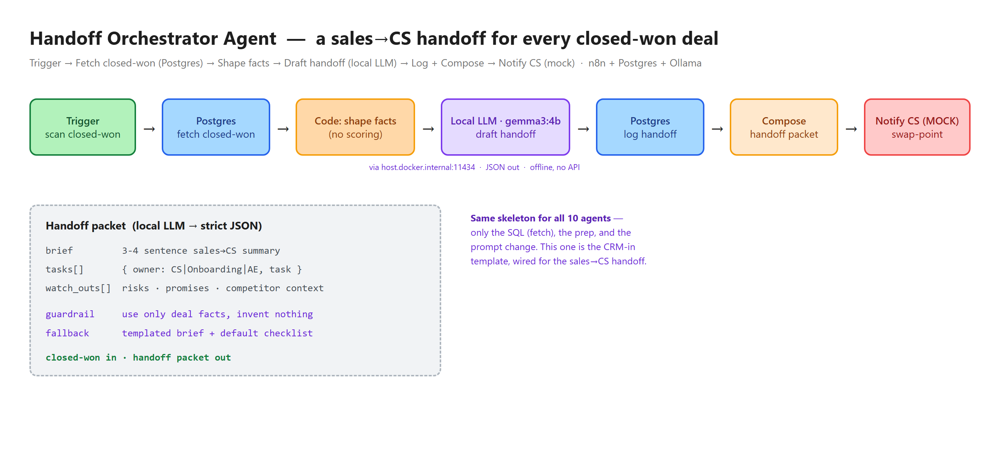

<!-- PUBLIC, publish-ready README for the `revops-ops` GitHub repo.
     At publish time this becomes the repo's README.md. Image paths point to assets/. -->

# Handoff Orchestrator Agent — when a deal is won, nothing falls through the cracks on the way to Customer Success

**Built by [SC Agentic Solutions](#about-sc-agentic-solutions) — we turn business bottlenecks into working AI automations.**

A deal closes, everyone celebrates — and then the handoff to Customer Success happens over a rushed Slack message and a half-filled CRM field. The promises made in the sale, the competitor you displaced, who actually championed the deal: it lives in the AE's head, and CS starts from zero. This agent scans your **closed-won** deals and drafts, for each one, a **sales→CS handoff packet**: a plain-English brief of what was sold and to whom, an **onboarding task checklist** with owners, and the **watch-outs** (risks and promises to honor) — then logs it.

It's the **fourth agent** in a series of small, focused RevOps automations built on one proven skeleton: fetch the data, reason with a private local LLM, log the result, notify. It goes back to the **CRM-in** shape of the reference [Deal Risk](https://github.com/santiagoceron10/revops-deal-review) agent — same template, different job.

> **Status:** ✅ System architecture & design + reference implementation — a complete, documented build you can deploy on your own stack (see setup below). The schema, workflow, and blueprint are complete and structurally validated. Every place a real CRM (Salesforce/HubSpot) or CS tool (Slack, a task system) would plug in is a labeled swap-point.

> **Demo project.** Designed to run entirely on your machine — [n8n](https://n8n.io) + PostgreSQL in Docker and a local [Ollama](https://ollama.com) model. **No cloud, no API keys, no data leaves your laptop.** The CRM is a mock Postgres database seeded with closed-won deals.



## What it does

Point it at your closed-won deals and run the scan. For each won deal it:

1. **Fetches** the deal from a mock CRM (`opportunities`, filtered to `stage = 'ClosedWon'`).
2. **Shapes** the facts that matter for a handoff — account, amount, owner rep, champion, competitor displaced, and any promise made in the sale.
3. **Drafts** the handoff with a local `gemma3:4b` model — strict JSON: a 3–4 sentence **brief**, an **onboarding checklist** (each task with an owner: CS / Onboarding / AE), and **watch-outs**.
4. **Logs** a handoff to the database (`handoffs`, with the task list stored as queryable JSON) — the audit trail.
5. **Composes** a clean, readable handoff packet and mock-notifies (the swap-point for creating CS onboarding tasks or posting to a CS channel).

The prompt tells the model to **use only the deal facts** — if there's no champion or no competitor on record, it won't invent one. And if the model ever returns something unparseable, the workflow **falls back** to a templated brief and a default onboarding checklist built from the deal fields, so a run never breaks.

## How it works

```
Run scan  →  Fetch closed-won deals (Postgres)  →  Shape deal facts (code)  →  Draft handoff (local LLM)
          →  Log handoff (Postgres)              →  Compose packet          →  Notify CS (mock)
```

Built in **n8n**, a visual workflow tool, so the logic is transparent and editable without touching code. Three parts are deliberately isolated as the "swap-points" you'd change to build a different RevOps agent from this same template: **the SQL** (what you fetch), **the prep** (the Code node that shapes the facts), and **the LLM prompt**.

The reasoning step calls a **local** model over HTTP (`http://host.docker.internal:11434` — n8n-in-Docker reaching Ollama on the host), asking for strict JSON so the result parses cleanly. It's private and offline by design.

## The handoff packet (what the model returns)

```json
{
  "brief": "3-4 sentence sales->CS summary: who bought, what/why, key contacts, commercial context",
  "tasks": [ { "owner": "CS | Onboarding | AE", "task": "…" } ],
  "watch_outs": [ "risks, promises made, competitor context to honor" ]
}
```

The seed includes deals with a champion + competitor (the brief names them and the watch-outs cite the competitor displaced) and a sparser deal (a generic onboarding checklist, no invented details) — so you can see both paths.

## Run it yourself

> This is the reference implementation — the steps below show how to stand it up on your own stack.

**Prerequisites:** [Docker](https://www.docker.com/products/docker-desktop/) and [Ollama](https://ollama.com) with the `gemma3:4b` model (`ollama pull gemma3:4b`).

```bash
# 1. Start Postgres (the mock CRM) and n8n on a shared network
docker network create sc-agentic
docker run -d --name n8n-postgres --network sc-agentic \
  -e POSTGRES_USER=n8n -e POSTGRES_PASSWORD=<choose-one> -e POSTGRES_DB=revops \
  -p 5432:5432 postgres:16
docker run -d --name n8n --network sc-agentic -p 5678:5678 \
  -v n8n_data:/home/node/.n8n docker.n8n.io/n8nio/n8n

# 2. Load the schema + seed (closed-won deals + the handoffs output table)
docker exec -i n8n-postgres psql -U n8n -d revops < revops-schema.sql

# 3. Make Ollama reachable from the n8n container (it must listen beyond localhost)
#    Set OLLAMA_HOST=0.0.0.0 and restart Ollama, then confirm from inside n8n:
docker exec n8n wget -qO- http://host.docker.internal:11434/api/tags
```

Then in n8n (`http://localhost:5678`): **Import from File → `handoff-orchestrator-agent.workflow.json`**, create a Postgres credential (host `n8n-postgres`, port `5432`, db `revops`, user `n8n`, your password, SSL off) and select it on the two Postgres nodes, then run the **Run handoff scan** trigger. Inspect the results in the `handoffs` table (the `tasks` column is JSON — one entry per onboarding task with `owner` / `task`).

## Tech stack

n8n (workflow engine) · PostgreSQL (mock CRM) · Ollama + `gemma3:4b` (local, private reasoning) · Docker · designed and built with **Claude** — Claude (as orchestrator) designed the flow and this documentation; Claude Code (as executor) built the workflow, schema, and template.

See **[DESIGN.md](DESIGN.md)** for the full design — schema, prep, prompt, fallback, and illustrative behavior.

## About SC Agentic Solutions

SC Agentic Solutions helps businesses go **from prototype to reality** with practical AI automations — the kind that save hours every week, not science projects. We design the workflow with you, build it, and hand you something that runs.

**Want an automation like this for your business?** Let's talk — reach out through GitHub.

---
*Part of the SC Agentic Demos portfolio — a growing set of AI-automation demos for business. Agent #4 in the RevOps agent series; it clones the same template as [Deal Risk](https://github.com/santiagoceron10/revops-deal-review), [Pipeline Coverage](https://github.com/santiagoceron10/revops-pipeline-forecasting), and [Meeting Recap](https://github.com/santiagoceron10/revops-stakeholder-comms), back in the CRM-in shape. A complete reference implementation in the RevOps agent series.*
